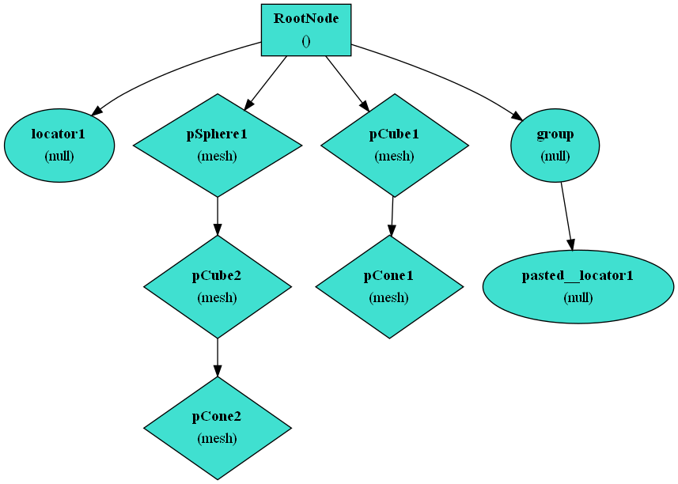

### FbxViz

A utility tool to help visualizing FBX `Dag` and `AnimationStack`.



### How to use 

run fbxviz executable followed by the absolute path to your fbx file.

e.g
```
cd <install_directory>

./fbxviz <abs_path_to_project>/examples/simple.fbx 
Generated graph to dag.dot successfully!!!
Generated graph to animstack.dot successfully!!!
FBX Sdk destroyed successfully!
```

### How to convert dot to svg or png 

```
dot dag.dot -Tpng -o dag.png
dot dag.dot -Tsvg -o dag.svg
```

### How to build

+ [Build Docs](BUILD.md)

